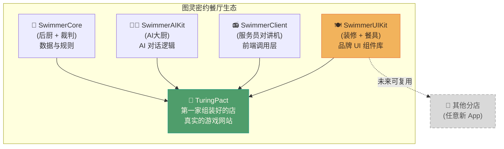

# SwimmerUIKit 从 0 开始学习指南

> 这套教程写给：**用 AI 编程约 2 年、没系统学过代码、擅长指挥 AI 的人**。
> 你不需要背术语，不需要记命令——理解"为什么"比"怎么写"更重要。

---

## 你在学什么？一张图看懂全局

SwimmerUIKit 是 PieAI 这家"图灵密约"餐厅生态里的**装修与餐具套装**。

**SwimmerUIKit 是什么：** 一套黏土(clay)质感的品牌 UI 组件库。你可以把它想成：**一套统一品牌的"装修风格 + 定制餐具"**。餐厅换了分店，装修和餐具不用重新设计，直接拿来用。

**包名是：** `@pieai/swimmer-ui-kit`（公开发布在 npmjs）

---

## 餐具为什么要单独打包？（核心问题先答）

你可能会问：直接在每个网站里写 CSS 和按钮不行吗？

想象一下：PieAI 做了 TuringPact，将来还要做第二个游戏、第三个网站。如果每个网站都各写一套按钮，那：
- 样式容易走样，品牌不统一
- 改个颜色要改三处
- 复制粘贴容易出 bug

SwimmerUIKit 的解法：**把餐具单独打包，所有分店从同一个包里取用**。

---

## 这套教程怎么读

| 篇号 | 标题 | 难度 | 预计时间 | 你会学到 |
|------|------|------|----------|----------|
| [01](./01-why-separate-ui-kit.md) | 为什么要把 UI 单独抽成"装修包" | 🟢 初级 | 约 8 分钟 | 品牌统一、复用的核心动机 |
| [02](./02-components-and-tokens.md) | 组件 vs 设计令牌：两种"餐具"的区别 | 🟢 初级 | 约 10 分钟 | 什么是组件、什么是令牌、为什么令牌用 CSS 变量 |
| [03](./03-why-no-app-dependency.md) | 餐具不挑哪家店：组件为什么不能依赖具体 App | 🟢 初级 | 约 9 分钟 | 解耦设计、props 注入、peerDependencies |
| [04](./04-use-in-new-app.md) | 跟着走一遍：在新 App 里用上这套 UI | 🟢 初级 | 约 12 分钟 | 安装流程、引入样式、使用组件 |
| 05（待撰写） | 中级总览：这套库的内部设计逻辑 | 🟡 中级 | 约 10 分钟 | token 分类体系、发布结构、与 TuringPact 的关系 |

**建议顺序：** 按篇号从头读。每篇都有虚拟人物故事贯穿，读完会自然衔接下一篇。

---

## 贯穿人物

整套教程跟着 **小邱** 一起学。

**小邱是谁：** 一个用 AI 做了两年独立产品的设计师，最近想给自己的游戏 App 换上 PieAI 的黏土风格 UI，但她没有系统学过前端，全靠 AI 帮忙写代码。她的口头禅是："你帮我写，但先给我解释清楚为什么。"

---

*本系列教程已更新到 SwimmerUIKit v1.0.0，2026年7月。*
