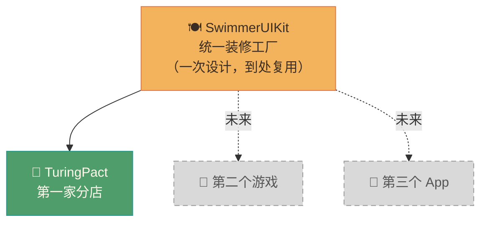

# 第 01 篇：为什么要把 UI 单独抽成"装修包"？

> 🟢 初级 | 预计阅读 8 分钟
>
> **读完这篇你会知道：** 为什么 PieAI 要把按钮、弹窗这些东西单独打成一个包，而不是每个项目各写一套。

---

## 故事开始

小邱这周打开了 TuringPact 的代码仓库。她想给自己的新游戏 App 也用上同款黏土风格的按钮——那个圆润的橙色大按钮特别好看。

她问 AI："我能直接复制 TuringPact 的按钮代码过去用吗？"

AI 说："可以，但有个更好的方案。"

---

## 先来想象一个场景：连锁餐厅的困境

假设你开了一家叫"图灵密约"的连锁餐厅，现在有三家分店：

- **A 店**（上海）：自己做了一套棕色木质风格的餐具和装修
- **B 店**（北京）：又重新做了一套，"感觉差不多"
- **C 店**（广州）：又来了一遍

结果有一天你发现：三家店的 Logo 颜色微微不同，杯子形状也不一样，客人觉得"这三家不像一个品牌"。

更糟的是——当你决定把品牌主色从橙色改成红色时，你要去改**三家店**的**所有餐具和装修**。这要累死人。

```mermaid
graph LR
    subgraph 没有统一装修包 — 每家店各做一套
        A["🏪 A店\n自己的按钮\n自己的颜色"]
        B["🏪 B店\n自己的按钮\n自己的颜色"]
        C["🏪 C店\n自己的按钮\n自己的颜色"]
    end
    品牌改色 -->|要改三处| A
    品牌改色 -->|要改三处| B
    品牌改色 -->|要改三处| C
    style 品牌改色 fill:#d85a45,color:#fff
```

---

## SwimmerUIKit 的解法：统一餐具工厂

SwimmerUIKit 就是那个**统一餐具工厂**。

所有分店——TuringPact、未来的第二个游戏、第三个网站——都从同一个工厂订货：



现在改品牌颜色，只需要改**工厂里的一处**，所有分店自动更新。

---

## 这个"工厂包"里装了什么？

SwimmerUIKit 里有两大类东西：

| 类型 | 比喻 | 例子 |
|------|------|------|
| **组件** | 成品餐具（按钮、弹窗、面板） | `GameButton`、`GameDialog`、`GamePanel` |
| **设计令牌** | 颜色配方、尺寸规格表 | 橙色 `#e8743b`、圆角 `18px`、字体大小 |

（下一篇会详细解释这两种的区别——先记住"有这两类东西"就够了。）

---

## 包的技术身份

SwimmerUIKit 是一个 **npm 包**（你可以理解为"一个可以安装的工具箱"）。

- **包名：** `@pieai/swimmer-ui-kit`
- **当前版本：** `1.0.0`
- **发布在：** npmjs 公共 registry（读取和安装不需要 token）

小邱说："npm 包？我不太懂这个。"

AI 解释："就像手机 App Store。你想用一个工具，去 App Store 搜索安装就行了。npm 是给代码项目用的'App Store'，`@pieai/swimmer-ui-kit` 就是包名，相当于 App 的名字。"

---

## 这套 UI 的风格是什么？

SwimmerUIKit 的核心视觉风格是 **clay（黏土）质感**：

- 圆润的圆角（最小的控件也是 999px 圆角）
- 温暖的米黄/棕色色调（底色 `#f3e8d8`，主色橙色 `#e8743b`）
- 类似浮雕的阴影感（按钮有内/外双层阴影）
- 字体偏粗重（标题字重 930）

这不是普通的"扁平化设计"，而是一种有厚度感的游戏 UI 风格。

---

## 为什么叫"Swimmer"？

PieAI 的几个项目都带"Swimmer"前缀：SwimmerCore、SwimmerAIKit、SwimmerClient、SwimmerUIKit。这是 PieAI 内部的产品族命名，把它们想成同一个"品牌家族"的成员就行了。

---

## 快速回顾

| 你可能会问 | 简短答案 |
|-----------|----------|
| 为什么不直接在每个项目里写按钮？ | 样式容易走样，改一处要改多处，维护成本高 |
| SwimmerUIKit 里有什么？ | 组件（成品餐具）+ 设计令牌（颜色/尺寸规格） |
| 它是给谁用的？ | 所有 PieAI 旗下的 App，目前接入了 TuringPact |
| 我需要会写代码才能用它吗？ | 不需要——只需要会指挥 AI，下面几篇会展示怎么做 |

---

**下一篇：** [02 - 组件 vs 设计令牌：两种"餐具"的区别](./02-components-and-tokens.md)

小邱听完第一篇，说："好，我明白了'为什么要抽包'。但你说的'设计令牌'是什么意思？按钮我懂，令牌是什么？"

→ 这正是下一篇要解答的问题。
