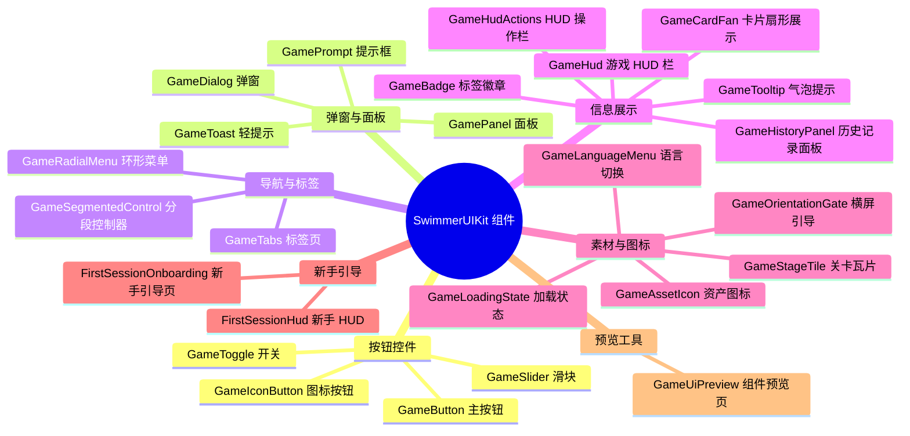
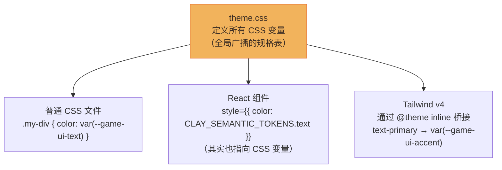
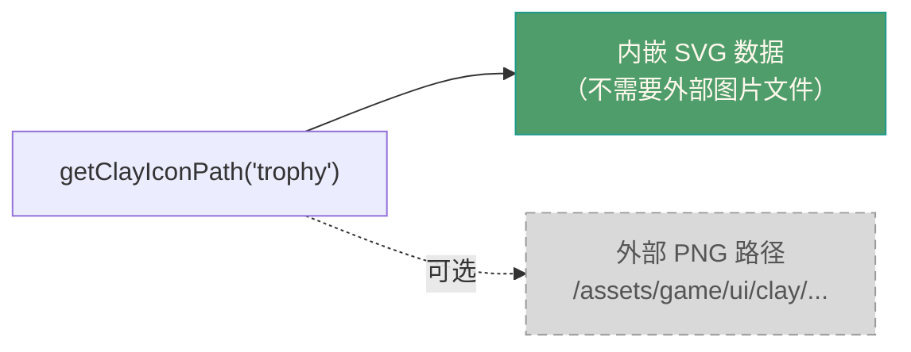

# 第 02 篇：组件 vs 设计令牌——两种"餐具"的区别

> 🟢 初级 | 预计阅读 10 分钟
>
> **读完这篇你会知道：**
> 1. 组件和设计令牌是什么，有什么区别
> 2. 为什么令牌要用 CSS 变量而不是普通数字
> 3. SwimmerUIKit 具体导出了哪些东西

---

## 故事继续

小邱打开了 SwimmerUIKit 的 README，看到两种东西：

```
Components（组件）
Tokens and assets（令牌和素材）
```

她说："组件我大概知道——就是按钮之类的吧？但'令牌'是什么？为什么不直接写 `color: orange`？"

---

## 先说组件：成品的定制餐具

**组件**（Component）就是**做好的、可以直接摆上桌的餐具**。

每个组件都是一个独立的 UI 块：你传给它内容，它负责长什么样、怎么交互。

SwimmerUIKit 的组件清单（按功能分类）：



小邱说："这么多！都是以 `Game` 开头的。"

AI："对，这是命名约定。`Game` 前缀表示这些组件属于'游戏界面'风格的 UI 库，跟普通企业后台的风格不一样。"

---

## 再说设计令牌：颜色配方和规格表

**设计令牌**（Design Token）是**一套有名字的设计规格**，比如：

- 主色是什么橙色？→ `#e8743b`
- 按钮圆角多大？→ `999px`（完全圆润的胶囊形）
- 普通字体大小是多少？→ `0.95rem`
- 弹窗阴影怎么设定？→ `0 32px 90px rgba(48,30,18,0.38)`

与其在每个组件里硬写 `color: #e8743b`，不如给这个橙色起个名字叫 `accent`，然后到处引用这个名字。

**好处：改颜色只要改一处名字背后的值，所有用到它的地方自动更新。**

```mermaid
graph LR
    subgraph 没有令牌 — 硬写颜色
        B1["按钮\ncolor: #e8743b"]
        B2["标题\ncolor: #e8743b"]
        B3["链接\ncolor: #e8743b"]
        CHANGE["改品牌色！"] -->|要改 3 处| B1
        CHANGE -->|要改 3 处| B2
        CHANGE -->|要改 3 处| B3
    end
```

```mermaid
graph LR
    subgraph 有了令牌 — 统一命名
        TOKEN["--game-ui-accent: #e8743b\n（令牌，只有 1 处）"]
        C1["按钮\ncolor: var(--game-ui-accent)"]
        C2["标题\ncolor: var(--game-ui-accent)"]
        C3["链接\ncolor: var(--game-ui-accent)"]
        TOKEN --> C1
        TOKEN --> C2
        TOKEN --> C3
        CHANGE2["改品牌色！"] -->|只改 1 处 ✓| TOKEN
    end
```

---

## 为什么令牌用 CSS 变量，而不是普通数字？

这是理解 SwimmerUIKit 设计的关键。

SwimmerUIKit 里的令牌有**两种形式**同时存在：

### 形式一：TypeScript 常量（给 JS/TS 代码读）

```ts
// 颜色令牌 — 直接存具体颜色值
CLAY_COLOR_TOKENS.ink        // '#3b2d23'  （深棕色）
CLAY_COLOR_TOKENS.orange     // '#e8743b'  （主色橙）
CLAY_COLOR_TOKENS.parchment  // '#fff8ec'  （米白色）

// 语义令牌 — 存 CSS 变量名
CLAY_SEMANTIC_TOKENS.surface  // 'var(--game-ui-surface)'
CLAY_SEMANTIC_TOKENS.accent   // 'var(--game-ui-accent)'
```

### 形式二：CSS 变量（给样式文件和任何网页读）

```css
:root {
  --game-ui-accent: #e8743b;
  --game-ui-surface: rgba(255, 248, 236, 0.78);
  --game-ui-radius-control: 999px;
}
```

### 为什么要两种形式并存？

比喻时间。想象你的餐厅有一本"规格手册"：

- **CSS 变量**是手册里写的**统一规格**：比如"主色橙 = RGB(232, 116, 59)"
- **TypeScript 常量**是**给厨师看的便捷查阅表**，上面引用了手册里的那个编号

CSS 变量的独特之处在于：**它不只是 React 组件能用——任何网页代码都能读**。



小邱问："所以如果我想让自己写的普通 CSS 也用上这套颜色，可以直接用 `var(--game-ui-text)` 这样的变量？"

AI："对，只要你的页面里引入了 SwimmerUIKit 的 `styles.css` 文件，这些变量就全局生效了。"

---

## 令牌的分类

SwimmerUIKit 把令牌按用途分成了几类：

| 令牌分类 | 用途 | 例子 |
|----------|------|------|
| `CLAY_COLOR_TOKENS` | 原始品牌色板（具体 16 进制颜色值） | `ink`、`honey`、`teal`、`berry` |
| `CLAY_SEMANTIC_TOKENS` | 语义化颜色（按功能命名，指向 CSS 变量） | `background`、`surface`、`accent`、`danger` |
| `CLAY_TYPE_TOKENS` | 字体和文字排版 | 字号 `xs/sm/md/lg/xl/xxl`、字重、行高 |
| `CLAY_SPACE_TOKENS` | 间距（2px ~ 32px + 安全区） | `px8`、`px16`、`safeBottom` |
| `CLAY_RADIUS_TOKENS` | 圆角大小 | `bead`(999px)、`card`(18px)、`panel`(26px)、`modal`(34px) |
| `CLAY_ELEVATION_TOKENS` | 阴影层次感 | `button`、`panel`、`modal`、`inset`、`stroke` |
| `CLAY_MOTION_TOKENS` | 动画时间和缓动曲线 | `fast`(120ms)、`base`(220ms)、`easingPop` |
| `CLAY_LAYER_TOKENS` | z-index 层叠顺序 | `hud`(z:20)、`modal`(z:80)、`toast`(z:100) |
| `CLAY_TARGET_TOKENS` | 触控目标尺寸规格（存真实数字） | 最小触控面积 44px、手机横屏宽度 844px |
| `CLAY_ASSET_SIZE_TOKENS` | 图标和素材的标准尺寸 | `iconSm=22px`、`iconMd=34px` |

还有两个"合并包"：
- `CLAY_UI_TOKENS`：把所有分类打包成一个大对象，方便统一访问
- `GAME_UI_TOKENS`：展平后的令牌（可以直接用 `GAME_UI_TOKENS.surface` 而不用 `CLAY_UI_TOKENS.semantic.surface`）

> **小提示**：上表括号里的数字（如 `fast(120ms)`、`hud(z:20)`）是这些 CSS 变量在样式文件里的真实值，供参考。在 TypeScript 代码里，除了 `CLAY_TARGET_TOKENS`（触控规格，存实际数字）外，其他令牌存的都是 CSS 变量字符串（如 `'var(--game-ui-motion-fast)'`），需要通过 CSS 才能拿到实际数值。

---

## 素材令牌：图标的路径地址

除了颜色/尺寸令牌，还有一类素材（assets）：

- `CLAY_ASSETS`：黏土风格图标和面板图片的路径表
- `CLAY_ASSET_BASE_PATH`：所有素材的根路径
- `getClayIconPath(iconName)`：给你一个图标的路径（默认返回内嵌 SVG，不依赖服务器文件）



---

## 音效助手

SwimmerUIKit 还内置了一个**音效助手**：

- `playGameInteractionSound(options)`：播放一个短促的交互音效（用网页原生音频，不需要 mp3 文件）

这个音效在 `GameButton` 里是可选的，你通过 `sound` 属性传入配置就行了。

---

## 快速回顾

| 你可能会问 | 简短答案 |
|-----------|----------|
| 组件和令牌的区别是什么？ | 组件是成品UI块（按钮/弹窗），令牌是设计规格（颜色/尺寸/间距） |
| 为什么令牌要用 CSS 变量？ | CSS 变量可以全局生效，React 组件和普通 CSS 都能用，改一处到处更新 |
| `CLAY_COLOR_TOKENS` 和 `CLAY_SEMANTIC_TOKENS` 有啥区别？ | 颜色令牌存具体颜色值；语义令牌存 CSS 变量名（按功能命名，更有意义） |
| 有多少个组件？ | 约 25 个，涵盖按钮、弹窗、HUD、新手引导等游戏 UI 场景 |
| 我在哪里能看到所有组件长什么样？ | 在 SwimmerUIKit 目录下运行 `npm run dev` 启动预览页 |

---

**下一篇：** [03 - 餐具不挑哪家店：组件为什么不能依赖具体 App](./03-why-no-app-dependency.md)

小邱说："等等，你刚才说'你通过 props 传入配置'——这意味着组件本身不知道在哪个 App 里？它不会自己去读 TuringPact 的设置？"

AI："正是！这是整个库设计最关键的一点。下一篇专门讲这个。"
