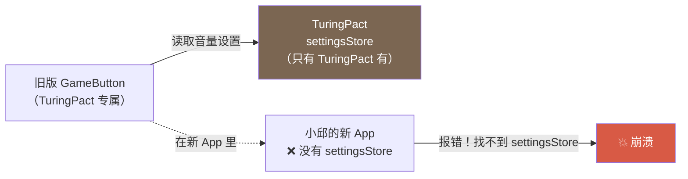
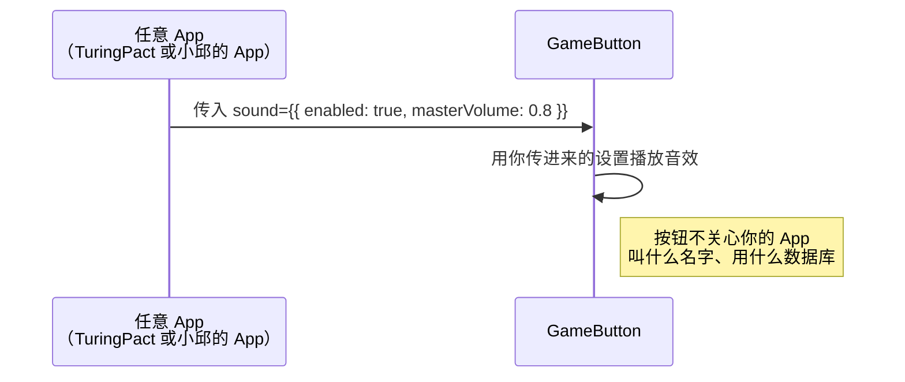
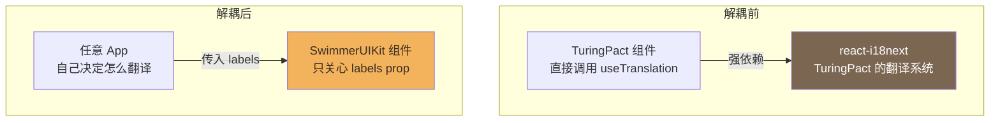
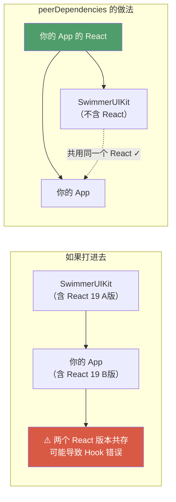
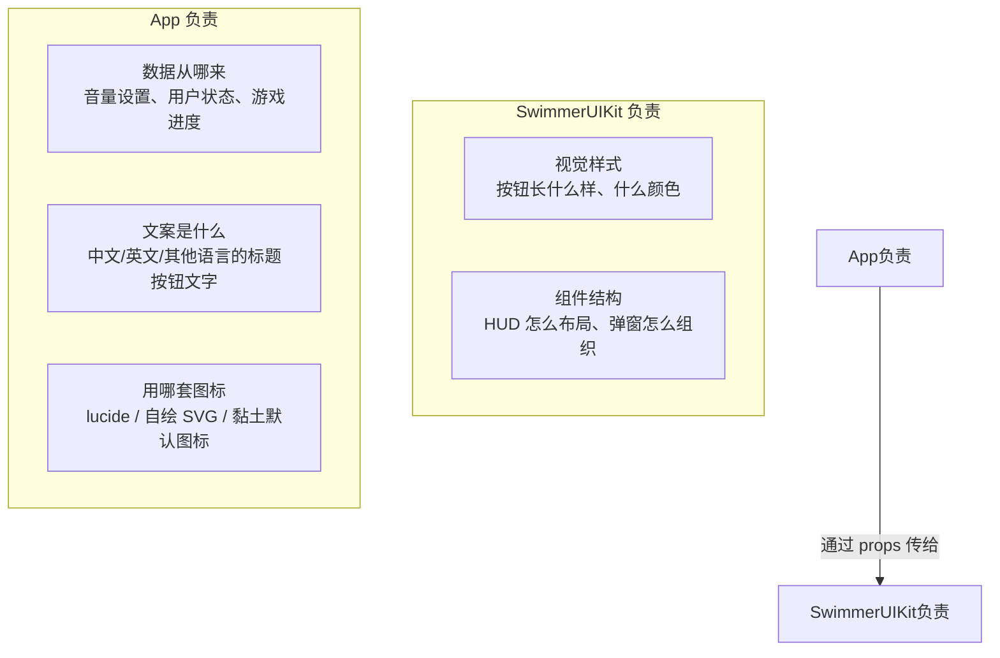

# 第 03 篇：餐具不挑哪家店——组件为什么不能依赖具体 App

> 🟢 初级 | 预计阅读 9 分钟
>
> **读完这篇你会知道：**
> 1. 什么叫"组件不依赖 App"（解耦）
> 2. Props 注入是什么，为什么它是答案
> 3. `peerDependencies` 是什么，大白话解释

---

## 故事：小邱发现了一个问题

小邱在翻 TuringPact 的旧代码时，发现了这样一段：

```ts
// 旧版 GameButton（TuringPact 里的版本）
import { useSettingsStore } from '../../stores/settingsStore'; // TuringPact 专属

function GameButton({ children, onClick }) {
  const { masterVolume, sfxVolume } = useSettingsStore(); // 直接读 TuringPact 的设置
  // ...
}
```

她问 AI："这个 `settingsStore` 是什么？"

AI："是 TuringPact 自己的'设置数据仓库'——存着用户的音量设定、游戏偏好之类的东西。"

小邱顿了一下："等等……如果我的新 App 没有 `settingsStore`，这个按钮就用不了了？"

AI："完全正确。这就是问题所在。"

---

## 问题：餐具设计成只能用在一家店

想象你订购了一批餐具，但这批餐具的设计是：**按下餐叉才能出菜，但前提是餐叉得接入 A 店的厨房电路**。

你把这批餐具搬到 B 店，插不上电，餐叉没法用了。

这就是**强依赖**的问题：



---

## 解法：用 Props 注入，让餐具"通用"

**Props**（属性）就是**你在使用组件时，手动把配置传进去的方式**。

就像餐叉改成了**自带电池**——你不需要接 A 店的电路，你在用它的时候直接告诉它"用多少电"就行了。

SwimmerUIKit 里的 `GameButton` 现在长这样：

```tsx
// 新版 GameButton（SwimmerUIKit 版）
// ✅ 不再读任何 App 的设置，靠 props 传入
export function GameButton({ children, onClick, sound = false }) {
  // sound 是你传进来的，不是从哪里偷偷读的
  if (sound) playGameInteractionSound(sound);
  // ...
}
```

用的时候，**你自己决定传什么进去**：



对应到代码，三种不同 App 使用同一个按钮：

| 你是谁 | 你可以对 AI 说的话 | AI 帮你写的代码 |
|--------|------------------|-----------------|
| TuringPact | 从 settingsStore 取音量，传给按钮 | `<GameButton sound={{ enabled: true, masterVolume: volume }}>` |
| 小邱的 App | 我想让按钮有声音，音量固定 80% | `<GameButton sound={{ enabled: true, masterVolume: 0.8 }}>` |
| 静音版网站 | 不要音效 | `<GameButton sound={false}>` |

同一个 `GameButton`，三种用法，互不干扰。

---

## 另一个解耦案例：多语言文案

旧版 `GameUiPreview` 里有这段代码：

```ts
// 旧版（TuringPact 专属）
import { useTranslation } from 'react-i18next'; // TuringPact 的多语言库
const { t } = useTranslation('common');
// 直接用 TuringPact 的翻译系统
```

这意味着在 TuringPact 之外，`useTranslation` 没有 Provider，整个组件会崩溃。

SwimmerUIKit 的处理方式：**把文案变成 props**。

```tsx
// 新版（SwimmerUIKit 版）
// 文案通过 labels prop 传入，包本身不管翻译
export function FirstSessionOnboarding({ labels, ... }) {
  return <h2>{labels.title}</h2>  // 用你传进来的文字
}
```



---

## 第三个解耦案例：图标

旧版 `FirstSessionGameShell` 用了 `lucide-react`（一个图标库）：

```ts
import { Settings, History } from 'lucide-react'; // TuringPact 的图标选择
```

SwimmerUIKit 不强制你用 lucide，而是：

1. 默认用**包自带的黏土风格 SVG 图标**（`GameAssetIcon`）
2. 如果你想换成别的图标，通过 `iconSlots` prop 传入

```tsx
// 你可以不传 iconSlots，用默认的黏土图标
<FirstSessionHud labels={...} ... />

// 或者传入你自己的图标（比如 lucide 或任何其他库）
<FirstSessionHud
  iconSlots={{
    settings: <SettingsIcon />,  // 你自己的图标组件
    history: <HistoryIcon />,
  }}
  ...
/>
```

---

## peerDependencies 是什么？

小邱说："我在 README 里看到一个词叫 `peerDependencies`，这是什么？"

AI 解释：

> **想象你买了一台游戏机（SwimmerUIKit）。游戏机需要电视才能显示画面，但游戏机盒子里没有附一台电视——这是因为你家里肯定有电视了，没必要再附一台。**

`peerDependencies`（对等依赖）就是这种逻辑：

SwimmerUIKit 说："我需要 React，但我不把 React 打包进来——因为你的 App 里肯定已经有 React 了，你用你自己的那份就行。"

SwimmerUIKit 要求"你家里要有"的东西：

| 依赖 | 最低版本 | 用途 |
|------|----------|------|
| `react` | 19.0.0 | React 本体，用来写组件 |
| `react-dom` | 19.0.0 | React 的 DOM 渲染器 |
| `tailwindcss` | 4.0.0 | CSS 工具类框架 |
| `@tailwindcss/vite` | 4.0.0 | Tailwind 的构建工具插件 |

**为什么不把 React 打进包里？**



---

## 小结：解耦设计的三层

SwimmerUIKit 的组件和 App 之间的关系，可以用"三层隔离"来理解：



---

## 快速回顾

| 你可能会问 | 简短答案 |
|-----------|----------|
| 什么叫组件"不依赖 App"？ | 组件不直接读 App 的数据库、设置、翻译系统，而是让 App 通过 props 传进来 |
| Props 是什么？ | 使用组件时传给它的配置参数，就像"给游戏机设定音量" |
| peerDependencies 是什么？ | "我需要 React，但不附赠，请自备"——避免版本冲突 |
| 为什么要这样设计？ | 让同一个组件能在任何 App 里用，不被某个 App 绑架 |

---

**下一篇：** [04 - 跟着走一遍：在新 App 里用上这套 UI](./04-use-in-new-app.md)

小邱说："OK，我理解了。但具体怎么在我自己的 App 里安装并用上这套 UI？能不能帮我过一遍？"

→ 下一篇就是实操演练，跟着小邱一起走完整个流程。
