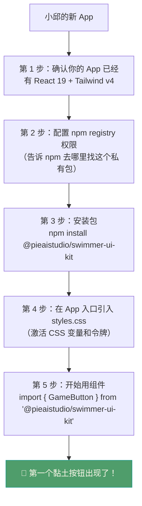
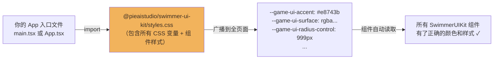
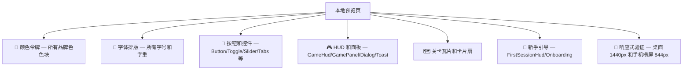
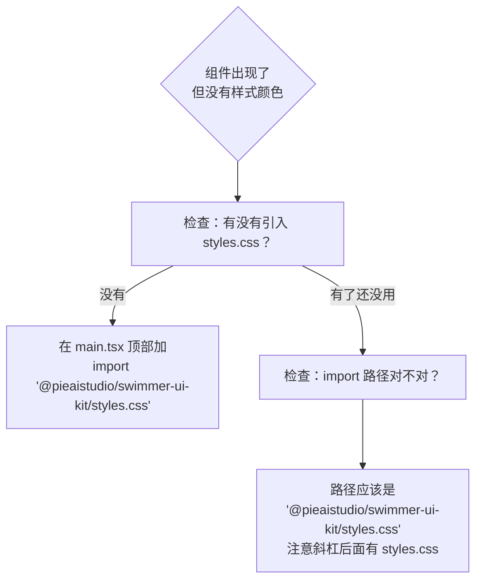
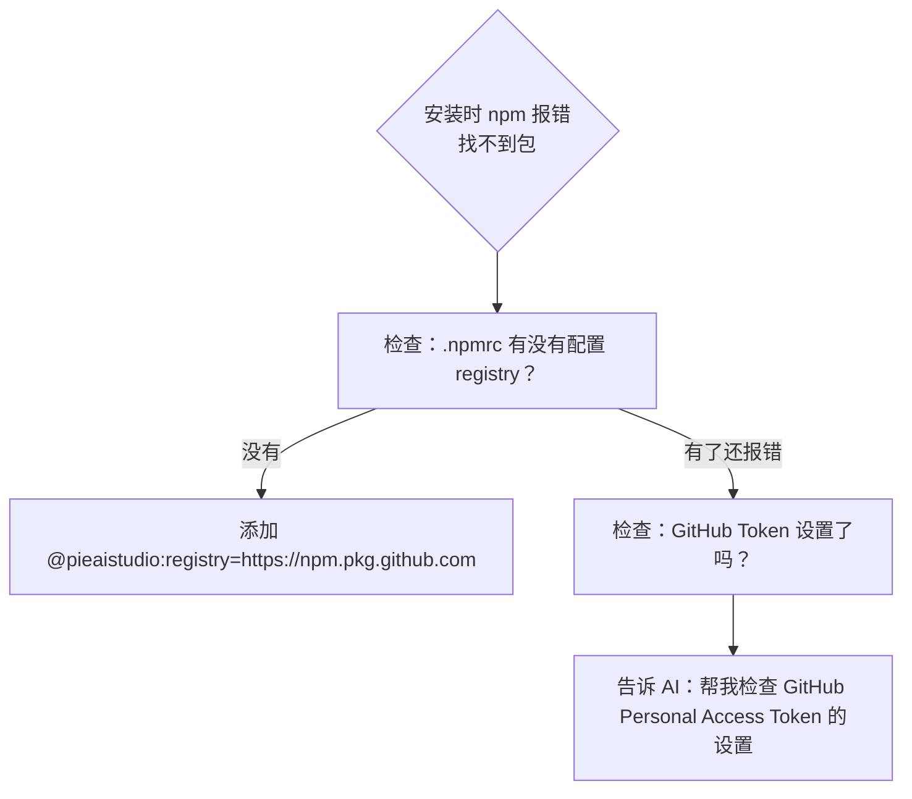

# 第 04 篇：跟着走一遍——在新 App 里用上这套 UI

> 🟢 初级 | 预计阅读 12 分钟
>
> **读完这篇你会知道：**
> 1. 在新 App 里安装 SwimmerUIKit 需要哪些步骤
> 2. 引入样式、使用组件的基本方式
> 3. 如何看到所有组件的样子（本地预览）

---

## 故事：小邱开始动手了

小邱已经有了自己的 React 项目（用 Vite 创建的），现在她想把 SwimmerUIKit 的黏土风格 UI 用进去。

她打开 AI，说："现在帮我一步一步来，从安装到看到第一个按钮。"

---

## 先理解整体流程

在走之前，先看一张地图：



---

## 第 1 步：确认前置依赖

SwimmerUIKit 需要你的 App 里已经有：

| 必须有 | 最低版本 |
|--------|----------|
| React | 19.0.0 |
| react-dom | 19.0.0 |
| tailwindcss | 4.0.0 |
| @tailwindcss/vite | 4.0.0 |

**小邱对 AI 说的话（可以直接复制）：**

> 帮我检查一下我的 package.json，看看我有没有 React 19 和 Tailwind v4，如果没有帮我装上。

---

## 第 2 步：配置 registry 权限

SwimmerUIKit 发布在 GitHub 的私有 npm registry，不是默认的公开 npm。

你需要让你的项目知道：`@pieaistudio` 开头的包要去 GitHub 找。

**小邱对 AI 说的话：**

> 帮我在项目根目录创建或编辑 `.npmrc` 文件，添加一行：
> `@pieaistudio:registry=https://npm.pkg.github.com`
> 并告诉我怎么设置 GitHub Personal Access Token 让 npm 有权限下载私有包。

> 注意：这个 Token 是你自己 GitHub 账号的权限钥匙，不要告诉 AI、不要提交到 git。

---

## 第 3 步：安装包

**小邱对 AI 说的话：**

> 帮我安装 `@pieaistudio/swimmer-ui-kit`。

AI 执行的命令背后是：

```
npm install @pieaistudio/swimmer-ui-kit
```

安装完成后，你的 `node_modules` 里会多出一个 `@pieaistudio/swimmer-ui-kit` 文件夹，里面有预先构建好的组件代码、类型定义、和 CSS 文件。

---

## 第 4 步：在入口引入样式（非常重要！）

这是**最容易忘记的一步**，也是**最关键的一步**。

SwimmerUIKit 的所有 CSS 变量（颜色、圆角、字体、阴影）都定义在 `styles.css` 里。

你必须在你的 App 最顶层的入口文件里引入它，否则所有组件都会"裸奔"——没有颜色、没有样式。



**小邱对 AI 说的话：**

> 帮我在 main.tsx（或 App.tsx）最顶部加上这行导入：
> `import '@pieaistudio/swimmer-ui-kit/styles.css';`

---

## 第 5 步：用第一个组件

现在可以使用组件了。

**小邱对 AI 说的话：**

> 帮我在页面里放一个橙色的"开始游戏"按钮，用 SwimmerUIKit 的 GameButton，主要变体（primary），点击时有音效。

AI 会帮你写出：

```tsx
import { GameButton } from '@pieaistudio/swimmer-ui-kit';

function MyPage() {
  return (
    <GameButton
      variant="primary"
      sound={{ enabled: true, masterVolume: 0.8, sfxVolume: 0.6 }}
      onClick={() => console.log('开始游戏！')}
    >
      开始游戏
    </GameButton>
  );
}
```

**`GameButton` 的可用选项：**

| 属性 | 可选值 | 默认值 | 用途 |
|------|--------|--------|------|
| `variant` | `primary` / `secondary` / `ghost` / `danger` / `success` | `secondary` | 按钮样式风格 |
| `sound` | `{ enabled, masterVolume, sfxVolume }` 或 `false` | `false` | 音效配置 |
| `onClick` | 函数 | — | 点击时做什么 |
| `disabled` | `true` / `false` | `false` | 禁用状态 |

---

## 第 6 步：用设计令牌让你的自定义样式也统一

当你需要写一些不在 SwimmerUIKit 组件范围内的自定义样式时，可以直接用 CSS 变量：

**小邱对 AI 说的话：**

> 帮我做一个自定义的游戏计分板，背景颜色要和 SwimmerUIKit 的面板颜色一致，文字颜色也要统一。

AI 会使用 CSS 变量：

```css
.my-score-board {
  background: var(--game-ui-panel);
  color: var(--game-ui-text);
  border-radius: var(--game-ui-radius-panel);
  box-shadow: var(--game-ui-shadow-panel);
}
```

这样即使将来 SwimmerUIKit 更新了主题颜色，你的计分板也会自动跟着更新。

---

## 本地预览：看到所有组件

在安装 SwimmerUIKit **之前**，或者你想看"这个包里到底有哪些组件长什么样"，可以把 SwimmerUIKit 的代码仓库 clone 下来，在它自己的目录里启动预览。

**小邱对 AI 说的话（在 SwimmerUIKit 项目目录下）：**

> 帮我启动 SwimmerUIKit 的本地预览页，看看所有组件的样子。

AI 执行：`npm run dev`（访问 `http://127.0.0.1:5174`）

预览页会展示：



---

## 从本地预览理解"你可以用什么"

看完预览，你可以告诉 AI 更具体的需求。

| 你看到了什么 | 你可以对 AI 说的话 |
|------------|-----------------|
| 橙色圆润大按钮 | 帮我用 GameButton variant="primary" 做一个"加入游戏"按钮 |
| 浮起来的面板卡片 | 帮我用 GamePanel 做一个展示玩家信息的卡片 |
| 顶部 HUD 栏 | 帮我用 GameHud 做一个显示金币、血量、时间的游戏状态栏 |
| 圆形语言切换按钮 | 帮我用 GameLanguageMenu 做语言切换，支持中文/英文 |
| 横屏提示页 | 帮我用 GameOrientationGate 在竖屏时提示用户旋转手机 |

---

## 常见问题排查





---

## 快速回顾

| 你可能会问 | 简短答案 |
|-----------|----------|
| 必须先有 React 19 吗？ | 是的，SwimmerUIKit 要求 React 19.0.0 以上 |
| 为什么要引入 styles.css？ | 它包含所有 CSS 变量（颜色/字体/圆角），不引入组件就没有样式 |
| 音效是怎么工作的？ | 用网页原生 Web Audio API，不需要 mp3 文件，通过 sound prop 开关 |
| 我能改颜色主题吗？ | 可以在你的 App 里覆盖 CSS 变量，比如 `--game-ui-accent: blue` |
| 私有 registry 是什么？ | 这个包发布在 GitHub 私有 npm，需要团队权限才能安装 |

---

**下一篇：** 05 - 中级总览：这套库的内部设计逻辑（待撰写）

小邱成功看到了第一个橙色按钮。她说："太好了。不过我还是不太明白这个包的整体架构——它的文件是怎么组织的？发布后别人拿到的是什么？"

→ 这是中级总览篇要回答的问题，给想深入了解的人。
