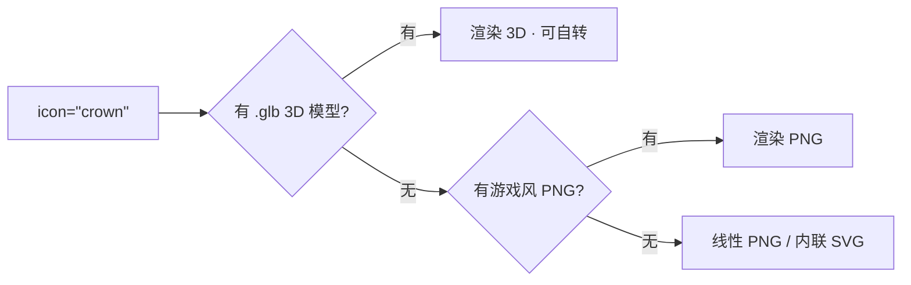

# 图标走向真 3D —— 可行性与接口设计(前瞻笔记)

> 状态:**只做思考,不写代码**(2026-06)。本文回答一个问题:
> 卡片里的图标,以后能不能从「一张小图片」升级成「一个真 3D 小物件、还能转一转」?
> 结论:**能,而且现在的架构已经替这件事留好了门。**

---

## 1. 一句话结论

能。而且**不会造成组件混乱**——因为今天的图标早就不是「一张图」,而是**一个名字**。

```tsx
<GameAssetIcon icon="crown" style="game" />
```

调用方写的是 `icon="crown"`,它**不知道**背后到底是 PNG、SVG 还是 3D 模型。
这就是关键:换「皇冠」的渲染方式,是套件内部的事,**所有用到皇冠的地方一行都不用改**。
这层「名字 → 资源」的间接层(`CLAY_ICON_VARIANTS` + `getClayIconPath`)就是未来接 3D 的**接缝**。

---

## 2. 为什么不会乱(三道保险)

1. **名字抽象**:消费者只认 `icon="crown"`,渲染后端可随便换。
2. **渐进式回退**:3D 模型 → 游戏风 PNG → 线性 PNG → 内联 SVG。
   缺哪一层就自动落到下一层。少数图标做成 3D,其余继续用 PNG,**不会半路崩**。
3. **默认关闭**:3D 是「可选升级」,不是「全量替换」。默认还是今天的 PNG。



---

## 3. 技术选型(成熟方案,别造轮子)

| 方案 | 是什么 | 适合 | 代价 |
|---|---|---|---|
| **`<model-viewer>`**(Google 官方 Web Component)| 一个标签吃 glTF/glb,自带轨道拖拽、`auto-rotate` 自转、懒加载 | **首选**。几行就能上,自带动画 | 单个约 ~80KB,需 WebGL |
| **react-three-fiber + drei** | React 风格的 Three.js | 要精细控制材质/灯光/交互时 | three.js 较重,需自己管性能 |
| **预渲染转盘(sprite sheet / APNG / 动画 WebP)** | 把 3D 提前渲染成「一圈帧」,前端当动图播 | 想要「伪 3D 转一转」但**不想上 WebGL** | 不能真交互;但最省、最稳、最兼容 |

> 用户提到「AI 生成的 3D 精度不高,但缩小当图标很好」——完全成立。
> 低模(low-poly)缩到 32–48px 当图标,瑕疵看不见;**glTF/glb** 是事实标准格式,
> Blender / 各类 AI-3D 工具都能导出。

---

## 4. 接口怎么留(等真要做时再写)

只需在现有结构上**加一层可选字段**,不破坏任何现有代码:

```ts
// 现在(2D 双族)
interface ClayIconVariants {
  game?: string;   // 游戏风 PNG
  line?: string;   // 线性 PNG
  // 未来加这一个:
  model?: string;  // .glb 3D 模型路径(可选)
}
```

渲染侧二选一:
- **轻**:给 `GameAssetIcon` 加 `render="3d"`(默认 `"2d"`),内部用 `<model-viewer>`,懒加载、按需 code-split。
- **稳**:不上 WebGL,`model` 字段指向「预渲染转盘动图」,沿用现有 ``,几乎零风险。

无论哪种,**`icon="crown"` 的写法都不变**。

---

## 5. 真正要小心的坑(都可控)

| 坑 | 说明 | 对策 |
|---|---|---|
| **性能** | 一页同时开 50 个 WebGL 画布会卡死 | 只给**少数主角图标**上 3D;其余留 PNG。或共用一个画布 / 实例化渲染 |
| **包体积** | three.js / glb 较重 | 懒加载,只在真用到 3D 时才下载;PNG 永远是默认 |
| **降级动画** | 自转动画对部分用户不友好 | 尊重 `prefers-reduced-motion`(套件已有此惯例)→ 停转 |
| **无 WebGL / SSR** | 老设备或服务端渲染没有 WebGL | 抽象层保证**永远能回退到 PNG**,不白屏 |
| **风格统一** | AI 生成的 3D 风格会飘 | 加一道「统一灯光/比例/黏土材质」的归一化,和今天 PNG 套图同样的纪律 |

---

## 6. 建议的落地节奏(以后,不是现在)

- **Phase 0(现在)**:维持 2D 双族。`GameAssetIcon` 抽象层就是接缝,**什么都不用动**。
- **Phase 1**:加可选 `model` 字段 + `render="3d"`,默认关闭,先拿 1–2 个英雄图标(皇冠 / 奖杯)试。
- **Phase 2**:补几个 `.glb`,在总览页/Storybook 开个「3D 图标」展示页(和今天的游戏风/线性并列成第三族)。
- **Phase 3**:悬停/空闲微动画 + `prefers-reduced-motion` 守卫。

> 一句话给未来的自己:**别现在就上 3D**;但今天的「名字 → 资源 + 回退」这套设计,
> 已经让以后接 3D 变成「加一个可选字段 + 一个新渲染分支」,而不是大手术。
