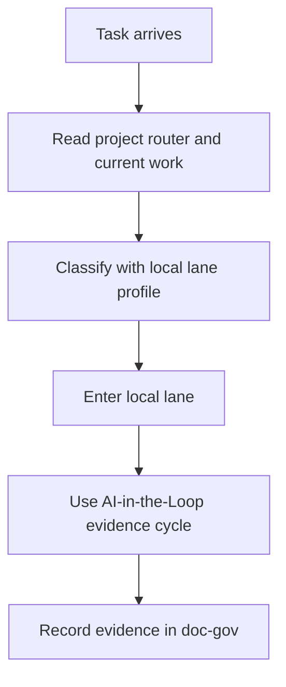

# Engineering Runtime Agents Routing v1.1

Shared routing algorithm for app, game, runtime, and code-heavy projects.

This file decides **how to choose a workflow**, not what the project is currently building. Current work belongs in the project's `docs/reference/execution/current-work.md` or equivalent.

## Core Flow

## Keep It Small

Use this router only to pick depth and workflow. Do not use it as a project roadmap.

## Local-First Verification And Release Boundary

- Before pushing, run the smallest project-local verification ladder that fully
  covers the changed surface. Do not use hosted CI as a remote debugging loop.
- If a relevant local gate fails, fix it locally before pushing. If it cannot run
  locally, record the exact blocker and do not push repeated guesses.
- Automatic hosted CI is a short independent smoke check. Keep it path-scoped,
  cached, least-privileged, time-bounded, and configured to cancel stale runs.
- Expensive browser, performance, packaging, staging, publishing, and deployment
  lanes are local or manually triggered release evidence unless a project records
  a specific exception.
- Implementation and release are separate phases. The same solo developer or AI
  may perform both, but a product task does not silently authorize publishing a
  shared package or mutating staging/production.

This is a behavior contract, not a requirement to add another hook, CI service,
or local tool. Reuse the project's existing scripts and verification ladder.

## Project-Local Lane Profile

Every engineering project must define its own lane profile in `AGENTS.md` or `docs/policy/best-practice-for-this-project.md`.

Typical lanes:

- visual / UX / game-feel
- content / config / canon
- behavior-critical code
- pure refactor

But the shared router must not define project-specific lanes.

## Host Compatibility Boundary

Follow the Project AI Host SSOT in `docs/governance/ssot-v1.1.md`. Host-specific
runtime settings must not create a second project router or skill tree.
